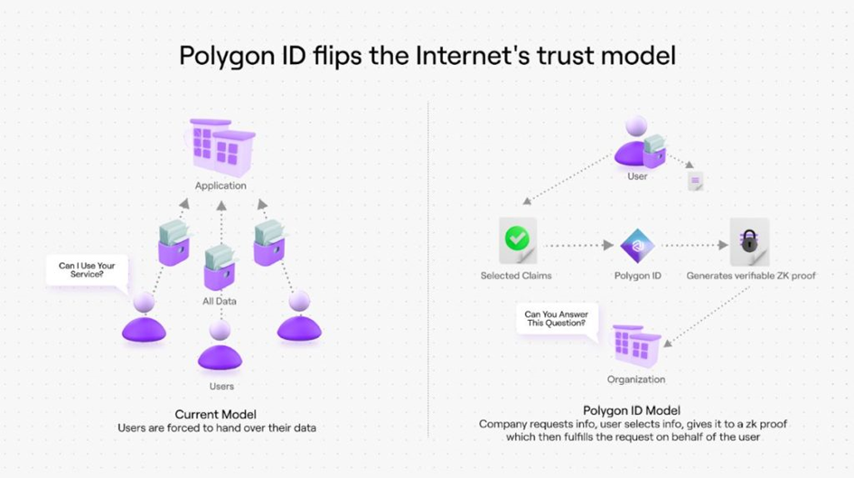

<a name="readme-top"></a>
<!-- TABLE OF CONTENTS -->
<details>
  <summary>Table of Contents</summary>
  <ol>
    <li>
      <a href="#ssi-technology">SSI Technology</a>
      <ul>
        <li><a href="#introduction">Introduction</a></li>
        <li><a href="#blockchain">Blockchain</a></li>
        <li><a href="#token">Token</a></li>
        <li><a href="#smart-contracts">Smart contracts</a></li>
        <li><a href="#zero-knowledge-proof">Zero knowledge proof</a></li>
        <li><a href="#identity-models">Identity models</a></li>
        <li><a href="#know-your-customer">Know Your Customer</a></li>
        <li><a href="#airdrop">Airdrop</a></li>
        <li><a href="#dapps">dApps</a></li>
        <li><a href="#decentralized-identifiers">Decentralized Identifiers</a></li>
        <li><a href="#digital-wallet">Digital wallet</a></li>
        <li><a href="#virtual-credentials">Virtual credentials</a></li>
      </ul>
    </li> 
    <li>
      <a href="#privado-id">Privado ID</a>
      <ul>
      </ul>
    </li> 
    <li><a href="#contributors">Contributors</a></li>
  </ol>
</details>


## Glossary

| **Term**                        | **Definition**                                                                                                                                                                                                                                         |
|---------------------------------|-----------------------------------------------------------------------------------------------------------------------------------------------------------------------------------------------------------------------------------------------------|
| **Self-Sovereign Identity (SSI)**| A digital identity model where individuals fully own, control, and manage their personal data.                                                                                                                                                       |
| **Polygon ID**                  | A decentralized identity solution built on the Polygon blockchain network.                                                                                                                                                                            |
| **Blockchain**                  | A decentralized ledger technology that records transactions across many computers so that the record cannot be altered retroactively.                                                                                                                 |
| **Token**                       | A digital asset created on a blockchain, representing ownership or participation in a project, service, or utility.                                                                                                                                   |
| **Smart Contracts**             | Simple programs that run on blockchain platforms, such as Ethereum, designed to execute specific actions automatically when predefined conditions are met. The lifecycle includes creation, deployment, execution, verification, and finalization.    |
| **Creation**                    | Writing the contract using a blockchain-specific programming language, including rules and conditions.                                                                                                                                               |
| **Deployment**                  | Translating the contract into a blockchain-readable format and distributing it across the network.                                                                                                                                                    |
| **Execution**                   | Automatically executing the contract when conditions are met.                                                                                                                                                                                        |
| **Verification**                | Ensuring all conditions were met and the contract executed correctly.                                                                                                                                                                                 |
| **Finalization**                | Recording the contract's outcome on the blockchain.                                                                                                                                                                                                   |
| **Key Features**                | Autonomous execution, cost and efficiency, interoperability, ownership and control, transparency, and security.                                                                                                                                       |
| **Zero-Knowledge Proof (ZKP)**  | A cryptographic protocol allowing one party to prove to another that they know a value without revealing the value itself.                                                                                                                            |
| **Properties**                  | Completeness, soundness, and zero-knowledge.                                                                                                                                                                                                          |
| **Cryptographic Mechanisms**    | Interactive proof systems and non-interactive zero-knowledge proofs (NIZK).                                                                                                                                                                           |
| **Practical Implementations**   | zk-SNARKs and zk-STARKs.                                                                                                                                                                                                                              |
| **Centralized Identity Model**  | A traditional model where a central authority manages and controls identity information.                                                                                                                                                              |
| **Federated Identity Model**    | A model where multiple organizations share and verify identity information through a trusted third party known as an Identity Provider (IDP).                                                                                                        |
| **Decentralized Identity Model**| A user-centric model where individuals control their identity data independently, often using blockchain technology.                                                                                                                                  |
| **Know Your Customer (KYC)**    | Regulatory processes used to verify the identity of clients and prevent illegal activities like money laundering and fraud.                                                                                                                            |
| **Know Your Business (KYB)**    | Similar to KYC, but focuses on verifying the legitimacy and details of businesses.                                                                                                                                                                    |
| **Airdrop**                     | A distribution mechanism where tokens or coins are sent to users' wallets for free, often to promote new projects or reward loyal users.                                                                                                              |
| **Decentralized Applications (dApps)** | Software applications that run on a blockchain or decentralized network, providing transparency, security, and trust without a central authority.                                                                                          |
| **Layer 1**                     | The identifiers and public keys layer for creating and managing DIDs and public keys.                                                                                                                                                                 |
| **Layer 2**                     | Protocols and interfaces for secure, private, and efficient communication between entities.                                                                                                                                                           |
| **Layer 3**                     | Issuance, management, and verification of verifiable credentials (VCs).                                                                                                                                                                               |
| **Layer 4**                     | Policies, rules, and standards ensuring the interoperability, trustworthiness, and compliance of the SSI ecosystem.                                                                                                                                   |
| **Decentralized Identifier (DID)** | A globally unique identifier that can identify any entity without being managed by a central authority, and is cryptographically verifiable.                                                                                                 |
| **Components**                  | Scheme, method, and unique string.                                                                                                                                                                                                                    |
| **Digital Wallet**              | A tool for storing and managing digital assets, including credentials, providing security, encryption, and backup/recovery options.                                                                                                                  |
| **Virtual Credentials (VCs)**   | Digital versions of traditional physical credentials, essential in SSI systems for identity verification, access control, and compliance certifications.                                                                                               |
| **Governance Framework**        | The policies, rules, and structures that govern the management and operation of decentralized identity systems.                                                                                                                                       |
| **Decentralized Key Management**| The processes and technologies used to manage cryptographic keys in a decentralized manner, ensuring security and control for users.                                                                                                                  |

<!-- SSI TECH -->
## SSI Technology

In this chapter, we will cover and define Self-Sovereign Identity - SSI and all the key terms and concepts necessary to understand this subject comprehensively.

<!-- INTRODUCTION -->
### Introduction

Self-Sovereign Identity (SSI) is a groundbreaking approach to digital identity management that empowers individuals to control and manage their personal information without relying on centralized authorities. Unlike traditional identity systems, where personal data is stored and controlled by governments, corporations, or other third parties, SSI allows individuals to store their identity data in a digital wallet and share it securely and selectively with others.

Key Principles :

- User Control and Ownership : in SSI, individuals own and control their personal data. They decide what information to share, with whom, and for how long. This control reduces the risk of data breaches and misuse.
  
- Decentralization : SSI eliminates the need for a central authority to manage identities. Instead, it uses decentralized technologies, such as blockchain, to create a distributed and tamper-proof system for verifying credentials.

- Privacy and Security : SSI enhances privacy by allowing users to share only the necessary information, minimizing data exposure. Security is achieved through advanced cryptographic techniques that protect data from unauthorized access.

<!-- BLOCKCHAIN -->
### Blockchain

#### What is Blockchain?
**Blockchain** is a decentralized ledger technology that records transactions across multiple computers to ensure security, transparency, and immutability. Each block contains a list of transactions, and once a block is completed, it is linked to the previous one, forming a chain of blocks.

#### Why Blockchain is Used in SSI
- **Decentralization**: Blockchain eliminates the need for a central authority to manage and verify identities, aligning with the core principle of SSI.
- **Immutability**: Once data is recorded on the blockchain, it cannot be altered or deleted, ensuring the integrity of identity information.
- **Transparency**: Transactions and data on the blockchain are transparent and can be verified by all participants, enhancing trust in the system.
- **Security**: Blockchain uses cryptographic techniques to secure data, reducing the risk of identity theft and fraud.
- **Interoperability**: Blockchain provides a standardized way to manage identities, allowing for seamless interaction across different platforms and services.

#### How Blockchain Works in SSI
1. **Identity Creation**: Individuals create their digital identities by generating a pair of cryptographic keys (public and private keys). The public key acts as a decentralized identifier (DID) on the blockchain.
2. **Credential Issuance**: Trusted entities (e.g., governments, universities) issue verifiable credentials (VCs) to individuals. These credentials are cryptographically signed and stored on the blockchain.
3. **Storage and Management**: Users store their DIDs and VCs in a digital wallet, which they control. This wallet interacts with the blockchain to verify and present credentials when needed.
4. **Verification**: When users need to prove their identity, they present the relevant VCs. Verifiers can use the blockchain to check the validity and authenticity of these credentials without accessing the underlying personal data.
5. **Privacy Preservation**: Blockchain can use zero-knowledge proofs (ZKPs) to verify information without revealing the actual data. This ensures that users can prove their identity or specific attributes (e.g., age) without disclosing unnecessary personal information.

<p align="right">(<a href="#readme-top">back to top</a>)</p>

<!-- TOKENIZATION -->
### Token

#### Tokens in SSI
**Tokens** are digital assets that represent various forms of value on the blockchain. In the context of SSI, tokens can be used to:
- **Incentivize Participation**: Tokens can reward users, credential issuers, and verifiers for participating in the SSI ecosystem.
- **Access Control**: Tokens can be used to manage access to services and resources, ensuring that only authorized users can access certain data or services.
- **Transaction Fees**: Tokens can be used to pay for transaction fees on the blockchain, ensuring the sustainability of the network.

#### Example: Polygon ID
**Polygon ID** is a decentralized identity solution built on the Polygon blockchain. It leverages the following blockchain features:
- **Scalability**: Utilizes Polygon’s high-speed, low-cost infrastructure for efficient identity verification transactions.
- **Privacy-Preserving**: Employs zero-knowledge proofs to verify identity without disclosing personal data.
- **Interoperability**: Works seamlessly with other blockchain platforms and traditional systems.
- **User Empowerment**: Enables users to control their own identity information and choose what to share and with whom.

<p align="right">(<a href="#readme-top">back to top</a>)</p>

<!-- SMART CONTRACTS -->
### Smart Contracts

Smart contracts are simple programs that run on blockchain platforms, such as Ethereum. They are designed to execute specific actions automatically when predefined conditions are met.The lifecycle of a smart contract into the following steps :

1. Creation : a developer writes the contract using a blockchain-specific programming language, such as Solidity for Ethereum. The contract includes rules and conditions agreed upon by the parties involved.

3. Deployment : the contract is deployed on the blockchain. At this point, it is translated into a format that can be understood and executed by the blockchain network. The contract now exists across multiple nodes, making it decentralized and resistant to tampering.

4. Execution : when the predefined conditions of the contract are met (these could be anything from a date, completion of a task, payment confirmation, etc.), the contract automatically executes the agreed-upon terms. For example, releasing funds to the appropriate party.

5. Verification : the blockchain network records and verifies the transaction, ensuring all conditions were met and the contract was executed according to its code.

6. Finalization : the output of the contract is recorded on the blockchain, providing an immutable, transparent, and secure record of the agreement and its execution.

Key Features of Smart Contracts :
- Autonomous Execution : once deployed, smart contracts operate autonomously. They do not require human intervention to execute their instructions.
- Cost and Efficiency : running smart contracts involves transaction fees, paid in the blockchain's native cryptocurrency (e.g., Ether on Ethereum). The fees, calculated in units called gas, ensure that the network remains sustainable and efficient.
- Interoperability : smart contracts can interact with each other, enabling complex chains of actions and logic. This interoperability supports various applications, from simple wallets to sophisticated identity systems.
- Ownership and Control : smart contracts can be owned by individuals, groups, or be entirely autonomous. The ownership model influences how the contract can be interacted with and controlled.
- Transparency and Security : the operations of smart contracts are transparent and verifiable by anyone on the network. This transparency enhances security and trust among participants.

The importance of smart contracts in SSI can be illustrated through their role in managing identity on blockchain platforms like Ethereum and with specific implementations like ERC 725 (focusing on making an Ethereum account into a public on-chain identity, which can have any amount of information attached) and ERC 1056 (in contrast keeps all of its identity information off-chain, the on-chain smart contract serves largely as a public key registry for that identity).

<p align="right">(<a href="#readme-top">back to top</a>)</p>

<!-- ZKP -->
### Zero Knowledge Proof

Zero-Knowledge Proofs are a type of cryptographic protocol that allows one party (the prover) to convince another party (the verifier) that they know a value or possess certain information without disclosing any details about the value itself.

ZKPs needs to have the following three properties :
- Completeness, if the statement is really true and both users follow the rules properly, then the verifier would be convinced without any artificial help.
- Soundness, in case of the statement being false, the verifier would not be convincedin any scenario.
- Zero-Knowledge, the verifier in every case would not know any more information.

Cryptographic Mechanisms :
- Interactive Proof Systems: Early ZKPs were interactive, requiring multiple rounds of communication between the prover and verifier.
- Non-Interactive Zero-Knowledge Proofs (NIZK): These allow the proof to be generated and verified without interaction, often using a common reference string available to both parties.

Practical Implementations :
- zk-SNARKs - Zero-Knowledge Succinct Non-Interactive Arguments of Knowledge: Used in blockchain technologies like Zcash for private transactions. They are efficient and allow for succinct proofs.
- zk-STARKs - Zero-Knowledge Scalable Transparent Arguments of Knowledge: Designed for scalability and transparency, eliminating the need for a trusted setup phase.

ZKPs are fundamental to SSI as they enable selective disclosure, allowing users to share only necessary information, enhance security by providing strong cryptographic guarantees and facilitate trust in decentralized systems by providing verifiable, tamper-proof proofs.

<p align="right">(<a href="#readme-top">back to top</a>)</p>

<!-- IDENTITY MODELS -->
### Identity Models

 ### Centralized Identity Model
The centralized identity model is a traditional approach where a single, central authority manages and controls identity information. This model is prevalent in systems where government agencies, social media platforms, or service providers issue and maintain identification data. In this setup, individuals create accounts with the central entity, linking their identity to these accounts. The central authority owns and controls the identity data, making decisions about its use and access. This model is characterized by a single point of control, where the central entity oversees the creation, update, and deletion of identity records.

One of the significant issues with this model is privacy. Users have limited control over their personal data, and the central authority can use or share this data without the user's explicit consent. Additionally, centralized databases are attractive targets for cyberattacks, leading to potential data breaches and identity theft. Despite these risks, the centralized model remains widely used due to its simplicity and historical precedence.

### Federated Identity Model
The federated identity model aims to address some of the limitations of the centralized model by allowing multiple organizations to share and verify identity information through a trusted third party known as an Identity Provider (IDP). This model enables Single Sign-On (SSO) capabilities, where users can access multiple services using one set of login credentials managed by the IDP.

In a federated system, users benefit from improved convenience and reduced redundancy, as they don't need to create separate accounts for each service. However, this model still presents privacy concerns since the IDP can potentially track user activities across different services. Furthermore, the dependency on the IDP means that if it is compromised, all relying parties are affected. Interoperability issues can also arise when different IDPs use varying standards and protocols.

### Decentralized Identity Model
The decentralized identity model, inspired by blockchain technology, represents a paradigm shift from centralized control to user-centric identity management. In this model, individuals have full control over their identity data and manage it independently. This approach uses Decentralized Identifiers (DIDs) and Verifiable Credentials (VCs) to establish and verify identities without relying on a central authority.

Decentralized identity systems allow for peer-to-peer relationships, where identities are managed directly between individuals and organizations. This model enhances privacy and security, as users can selectively disclose only the necessary information for a transaction or interaction. However, the decentralized model introduces technical complexity and requires new infrastructure and widespread adoption to become fully effective. Users must also manage their cryptographic keys securely to prevent identity loss.

<p align="right">(<a href="#readme-top">back to top</a>)</p>

<!-- KNOW YOUR CUSTOMER -->
### Know Your Customer

Know Your Customer - KYC and KYB Know Your Business - KYB are regulatory and due diligence processes used to verify the identity of clients and prevent illegal activities such as money laundering and fraud.

KYC involves a series of checks that financial institutions must conduct to verify the identity of their clients. This includes gathering information such as name, address, date of birth, and proof of identity (e.g., passport, driver's license). The aim is to ensure that clients are who they claim to be and to assess the risk they may pose. KYC procedures typically involve a Customer Indentification Program - CIP, collecting and verifying customer identification information, Customer Due Diligence - CDD, assessing the customer's risk profile based on their background and transactional behavior and continuous monitoring.

In the context of SSI and digital identity, KYC can be enhanced by using VCs allowing secure and real-time verification while maintaining privacy.

KYB is a similar process but focuses on verifying the legitimacy and details of businesses rather than individuals. Both KYC and KYB are essential components of anti-money-laundering- AML and counter financing - CTF frameworks, helping to mitigate risks and comply with regulatory requirements.

<p align="right">(<a href="#readme-top">back to top</a>)</p>

<!-- Airdrop -->
### Airdrop

Airdrops are a distribution mechanism in the cryptocurrency and blockchain ecosystem where tokens or coins are sent to user's wallets, typically for free. The purpose is often to promote new projects, increase the circulation of a token or reward loyal users.

<p align="right">(<a href="#readme-top">back to top</a>)</p>

<!-- DAPPS -->
### dApps

Decentralized applications, commonly known as dApps, are software applications that run on a blockchain or decentralized network rather than being hosted on centralized servers. They utilize smart contracts to facilitate various functions, providing transparency, security, and trust without a central authority.

In the context of SSI, dApps can be used to create, manage, and verify decentralized identities. For example, a dApp could allow users to store their verifiable credentials in a digital wallet, manage access to their personal data, and prove their identity to service providers without relying on a centralized identity authority.

<p align="right">(<a href="#readme-top">back to top</a>)</p>

<!-- DECENTRALIZED IDENTIFIERS -->
### Decentralized Identifiers

A Decentralized Identifier - DID is a new type of globally unique identifier that can be used to identify any entity, whether it be a person, organization, device, or other digital resource. Unlike traditional identifiers, DIDs are designed to be self-sovereign, fully under the control of the entity they identify.

DIDs are designed to be a permanent identifier that does not need to change even if the underlying system or service provider changes, aren't managed by any central authority and are cryptographically verifiable : the DID is associated with a public/private key pair, and control over the DID can be proven by demonstrating control over the corresponding private key.

A DID consists of three parts :

<div align="center">
    
</div>

The Scheme indicated that the identifier is a DID, the method defines how the DID and its associdated DID document are created, resolved, updates and deactivated and finally, and a unique string that identifies the specific entity within the context of the DID method. Here is an example with an Ethereum address :

```
did:ethr:0x123456789abcdef123456789abcdef123456789abcdef
```

<p align="right">(<a href="#readme-top">back to top</a>)</p>

<!-- DIGITAL WALLET -->
### Digital Wallet

These credentials can be kept in digital wallets capable of storing and managing such credentials but also providing security/encryption and backup/recovery options.

Digital wallets are often paired with digital agent, which act similarly to an operation system, mediating all interactions between the wallet, the user and other agents. Digital agents perform tasks such as generating cryptographic key pairs, initiating DID-to-DID connections, securing communication and managing credential issuance and verification.

<p align="right">(<a href="#readme-top">back to top</a>)</p>

<!-- VCs -->
### Virtual Credentials

Virtual Credentials - VCs refer to digital versions of traditional physical credentials. They are a cornerstone of SSI systems as they allow :

- Identity verification : VCs can be used for verifying identity in various contexts such as online banking, airport security, and digital onboarding processes. For example, a person could use a Virtual Credential issued by their government to verify their identity when opening a bank account online.
- Access control : VCs can control access to physical and digital spaces. For instance, employees could use Virtual Credentials to access office buildings or secure online resources, ensuring that only authorized personnel can enter or gain access.
- Compliance and certifications : educational institutions and professional organizations can issue VCs to certify qualifications, professional memberships, or compliance with industry standards. This allows individuals to prove their credentials easily and securely to potential employers or clients.

<p align="right">(<a href="#readme-top">back to top</a>)</p>


## Privado ID



**Definition**: A decentralized identity solution built on the Polygon blockchain network.

### Purpose
- **Decentralized Verification**: Allows for secure and private identity verification without intermediaries.
- **Interoperable Identities**: Supports identity use across different decentralized applications (dApps) within the Polygon ecosystem.

### Key Features
- **Scalability**: Utilizes Polygon’s high-speed, low-cost infrastructure to handle large volumes of identity verification transactions efficiently.
- **Privacy-Preserving**: Employs zero-knowledge proofs to verify identity without disclosing personal data.
- **Interoperability**: Designed to work seamlessly with other blockchain platforms and traditional systems.
- **User Empowerment**: Enables users to control their own identity information and choose what to share and with whom.

### Why It's Needed
- **Enhanced Privacy**: Reduces the amount of personal information shared, mitigating privacy risks.
- **Security**: Improves security by using blockchain technology to protect identity data.
- **Efficiency**: Streamlines identity verification processes, reducing costs and increasing speed.
- **Decentralization**: Eliminates reliance on central authorities for identity management, aligning with the principles of decentralization in blockchain technology.

### Overview
- Polygon ID is a self-sovereign, decentralized, and private identity solution for the next iteration of the Internet.
- It is powered by zero-knowledge (ZK) cryptography, a privacy and blockchain scaling technology.
- It leverages the Iden3 protocol and Circom ZK toolkit.
- Polygon ID is private by default, offers on-chain verification, and permissionless attestation.

### Benefits
- **User Control**: Puts users in control of their identity and personal data.
- **Social Coordination**: Facilitates social coordination by taking back power from third parties.
- **Privacy Guarantees**: Provides stronger privacy guarantees, enabling more use cases and increasing user adoption.
- **Cybersecurity**: Offers a solution to digital identity needs, addressing increasing cyberattacks and data breaches.
- **Future-Proof**: Presents a sustainable solution to global digital identity challenges.

### Developer Tools
- **Issuer Node**: A self-hosted API for creating verifiable credentials according to W3C standards, signed cryptographically to ensure tamper-proof credentials.
- **Wallet SDK**: Used to develop mobile wallets that request, store, and present credentials or proof of credentials using zero-knowledge proofs.
- **Verifier SDK**: Libraries for composing queries to verify credentials, supporting both off-chain and on-chain verification through smart contracts.

### Use Cases
- **Identity Wallets**: Like crypto wallets holding private keys, identity wallets hold identity keys and credentials.
- **Verifiable Credentials**: Issued by entities such as governments, universities, banks, KYC providers, oracles, DAOs, and reputation services.
- **Verification**: Enables secure, tamper-resistant verification of credentials, ensuring privacy through zero-knowledge proofs.

### Example Process
1. **Credential Issuance**: Issuers create credentials using the Issuer Node.
2. **Credential Storage**: Users collect and store credentials in their identity wallet.
3. **Credential Presentation**: Users present credentials or proofs to dApps or Smart Contracts (Verifiers) using the Wallet SDK.
4. **Verification**: Verifiers use the Verifier SDK to query and validate credentials, ensuring security and privacy.


<!-- CONTRIBUTORS -->
## Contributors

<div align="center">
  <table border="0">
    <tr>
      <td align="center" style="word-wrap: break-word; width: 150px; height: 150px; border: none;">
          <a href=https://github.com/crnjaja>
              
              <br />
              <sub style="font-size:14px"><b>crnjaja</b></sub>
          </a>
      </td>
            <td align="center" style="word-wrap: break-word; width: 150px; height: 150px; border: none;">
          <a href=https://github.com/Esvaria>
              
              <br />
              <sub style="font-size:14px"><b>Esvaria</b></sub>
          </a>
      </td>
    </tr>
  </table>
</div>


<p align="right">(<a href="#readme-top">back to top</a>)</p>


